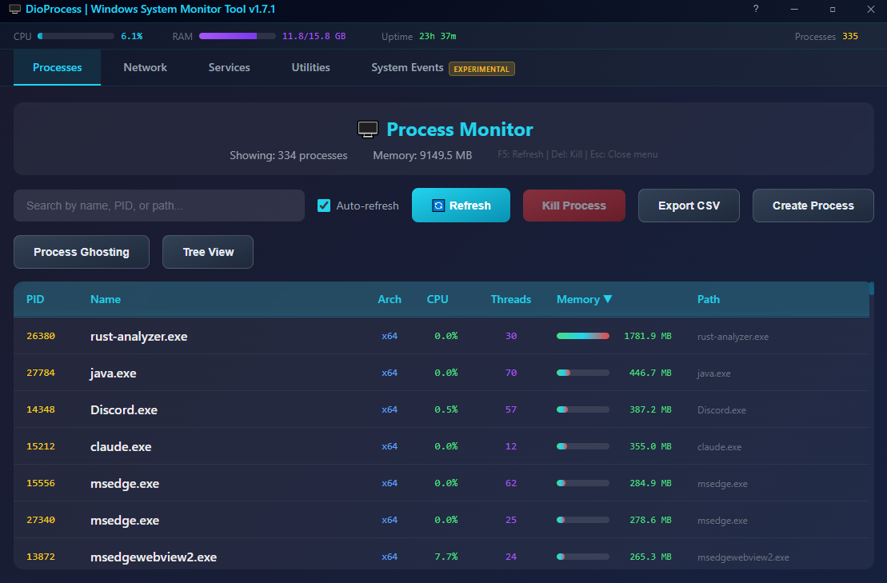
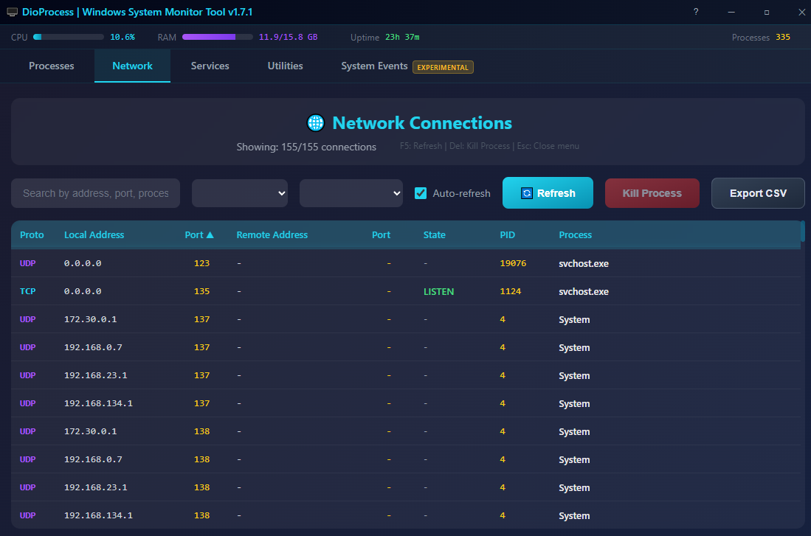
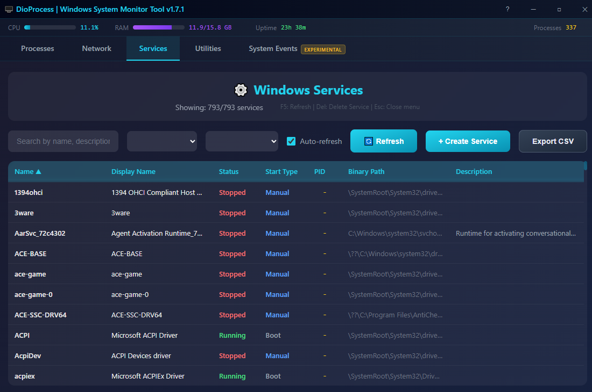

# DioProcess - Windows System Monitor

A modern, lightweight Windows system monitor built with **Rust**, **Dioxus**, and **Windows API**.






## Features

### Tab Navigation
- **Processes Tab** - Monitor and manage running processes
- **Network Tab** - View active network connections (TCP/UDP)
- **Services Tab** - View and manage Windows services

### Process Management
- **Process List** - View all running processes with PID, name, CPU, threads, memory, and path
- **Search & Filter** - Quick search by process name, PID, or executable path
- **Real-time Updates** - Auto-refresh every 3 seconds (toggleable)
- **Kill Process** - Terminate processes with a click or keyboard shortcut
- **Sortable Columns** - Sort by PID, Name, CPU, Threads, or Memory (ascending/descending)
- **Export to CSV** - Export filtered process list to CSV file
- **Create Process** - Launch new processes with two techniques:
  - **Normal (CreateProcess)** - Standard process creation, optionally suspended
  - **Process Hollowing** - Create host process suspended, replace its image with a payload PE

### Network Monitoring
- **Connection List** - View all TCP and UDP connections
- **Port Information** - Local and remote addresses with ports
- **Connection State** - LISTEN, ESTABLISHED, TIME_WAIT, CLOSE_WAIT, etc.
- **Process Mapping** - See which process owns each connection
- **Filters** - Filter by protocol (TCP/UDP) and connection state
- **Kill Process** - Terminate the process using a port
- **Open File Location** - Navigate to the executable
- **Export to CSV** - Export filtered connections to CSV file

### Service Management
- **Service List** - View all Windows services with name, status, start type, PID, and binary path
- **Search & Filter** - Filter by service name, status (Running/Stopped/Paused), or start type (Auto/Manual/Disabled)
- **Start Service** - Start stopped services
- **Stop Service** - Stop running services
- **Create Service** - Create new Windows services with custom configuration
- **Delete Service** - Remove services from the system
- **Sortable Columns** - Sort by Name, Display Name, Status, Start Type, PID, or Description
- **Real-time Updates** - Auto-refresh every 3 seconds (toggleable)
- **Export to CSV** - Export filtered services to CSV file

### System Monitoring
- **CPU Usage** - Global CPU usage with visual progress bar
- **RAM Usage** - Memory consumption (used/total GB) with progress bar
- **System Uptime** - Time since last boot
- **Process Count** - Total number of running processes

### User Interface
- **Modern Dark Theme** - Sleek gradient design
- **Borderless Window** - Custom title bar with drag, minimize, maximize, close
- **Responsive Layout** - Adapts to window resizing
- **Tab-based Navigation** - Switch between Processes, Network, and Services views

### Context Menu (Right-Click)
- Auto-repositions to stay within viewport on small windows (CSS `clamp`)
- Submenus open upward (bottom-anchored) to avoid clipping
- Kill Process
- Suspend Process
- Resume Process
- Open File Location
- Copy PID
- Copy Path
- Inspect (submenu)
  - Threads
  - Handles
  - Modules
  - Memory
  - Performance
- Refresh List
- Miscellaneous (submenu)
  - DLL Injection (submenu)
    - LoadLibrary - Classic CreateRemoteThread + LoadLibraryW
    - Thread Hijack - Suspend thread, redirect RIP to shellcode
    - APC Queue - QueueUserAPC + LoadLibraryW on all threads
    - Manual Map - Map PE sections, resolve imports, call DllMain
  - Steal Token - Steal process token and launch a new process under its security context

### Thread View (Right-click > View Threads)
- View all threads of a process in a modal window
- Suspend individual threads
- Resume individual threads
- Kill threads (use with caution!)
- Copy Thread ID
- Auto-refresh thread list

### Handle View (Right-click > View Handles)
- View all handles (files, registry, events, etc.) of a process
- Filter handles by type
- Close handles (use with caution!)
- Copy Handle value
- Color-coded handle types (File, Registry, Process, Sync, Memory, etc.)

### Module View (Right-click > View Modules)
- View all loaded DLLs/modules of a process
- Filter modules by name or path
- View module base address, size, and entry point
- Inspect module imports (functions imported from other DLLs)
- Inject DLL into process (LoadLibrary method)
- Unload/eject modules from process
- Copy module path
- Open module file location
- Auto-refresh module list

### Performance View (Right-click > View Performance)
- Real-time CPU usage graph with 60-second history
- Real-time memory usage graph with auto-scaling
- SVG-based smooth line graphs with fill area
- Pause/Resume monitoring
- Updates every second

### Memory View (Right-click > View Memory)
- View all virtual memory regions of a process
- Filter by address, state, type, protection, or module name
- Module name display for MEM_IMAGE regions (shows which DLL owns the memory)
- Hex dump viewer with pagination (4KB pages) and ASCII column
- Memory dump to .bin file (export any committed region)
- Commit reserved regions
- Decommit committed regions
- Free memory allocations
- Auto-refresh memory list

### Create Process (Button in toolbar)
- **Normal Mode (CreateProcess)**
  - Launch any executable with optional command line arguments
  - Option to create the process in a suspended state
  - Returns PID and Thread ID on success
- **Process Hollowing Mode**
  - Select a host executable (will be created suspended)
  - Select a payload PE (64-bit executable)
  - Unmaps the host's original image and replaces it with the payload
  - Applies base relocations if needed
  - Updates PEB and thread context, then resumes execution
  - Useful for advanced process manipulation and security research

### Ghost Process (Button in toolbar)
- Create a process whose backing file is deleted from disk
- Select a 64-bit payload executable
- Creates unique temp file, marks for deletion via `NtSetInformationFile`
- Writes payload, creates image section via `NtCreateSection(SEC_IMAGE)`
- File is deleted while the section survives
- Process is created from the orphaned section via `NtCreateProcessEx`
- Sets up PEB process parameters with `RtlCreateProcessParametersEx`
- Creates initial thread via `NtCreateThreadEx` with proper stack sizes from PE header
- Returns PID on success

### Token Thief (Right-click > Miscellaneous > Steal Token)
- Select a target process whose token you want to steal
- Pick an executable to launch under the stolen token's security context
- Optionally provide command line arguments
- Opens the target process, duplicates its primary token, enables SeAssignPrimaryTokenPrivilege, impersonates, and creates a new process via CreateProcessAsUserW
- Returns the new process PID and Thread ID on success
- Useful for privilege escalation research and security testing

### Keyboard Shortcuts
| Key | Action |
|-----|--------|
| `F5` | Refresh list |
| `Delete` | Kill selected process |
| `Escape` | Close context menu |

## Getting Started

### Prerequisites
- [Rust](https://rustup.rs/) (2021 edition)
- Windows 10/11

### Build & Run

```bash
# Clone the repository
git clone https://github.com/un4ckn0wl3z/dioprocess.git
cd dioprocess

# Build release version
cargo build --release

# Run the application
.\target\release\dioprocess.exe
```

### Development

```bash
# Run in development mode
cargo run

# Build with optimizations
cargo build --release
```

## Dependencies

| Crate | Version | Purpose |
|-------|---------|---------|
| `dioxus` | 0.6 | Desktop UI framework with router |
| `tokio` | 1.x | Async runtime for auto-refresh |
| `sysinfo` | 0.31 | CPU/Memory system statistics |
| `windows` | 0.58 | Windows API bindings |
| `arboard` | 3.x | Clipboard operations |
| `ntapi` | 0.4 | Native Windows API for process suspension |
| `rfd` | 0.15 | Native file dialogs for DLL selection and memory dump |

### Windows API Features Used

**process crate:**
- `Win32_System_Diagnostics_ToolHelp` - Process/Thread/Module enumeration
- `Win32_System_Threading` - Process/Thread management
- `Win32_System_ProcessStatus` - Memory information
- `Win32_System_Memory` - Virtual memory region enumeration (VirtualQueryEx)
- `Win32_System_Diagnostics_Debug` - Process memory reading (ReadProcessMemory)
- `Win32_Foundation` - Core Windows types
- `Win32_Security` - Process access rights
- `Win32_UI_Shell` - Shell operations

**network crate:**
- `Win32_NetworkManagement_IpHelper` - Network connections (TCP/UDP tables)
- `Win32_Networking_WinSock` - Socket address handling
- `Win32_Foundation` - Core Windows types

**service crate:**
- `Win32_System_Services` - Service Control Manager operations
- `Win32_Foundation` - Core Windows types
- `Win32_Security` - Service access rights

**misc crate:**
- `Win32_System_Memory` - Virtual memory allocation, commit, decommit, free
- `Win32_System_LibraryLoader` - Module loading/unloading
- `Win32_System_Threading` - Process creation (CreateProcessW, CreateProcessAsUserW), termination, token access (OpenProcessToken)
- `Win32_System_Diagnostics_Debug` - Process memory operations, thread context manipulation
- `Win32_System_Kernel` - Thread context structures (CONTEXT)
- `Win32_Storage_FileSystem` - File creation (CreateFileW, WriteFile) for process ghosting temp files
- `Win32_System_IO` - I/O status block types for NtSetInformationFile
- `Win32_Security` - Token duplication, privilege adjustment, impersonation (DuplicateTokenEx, AdjustTokenPrivileges, ImpersonateLoggedOnUser)
- `ntapi` - Native API for NtQueryInformationProcess, NtUnmapViewOfSection (process hollowing)

## Project Structure

This project uses a **Cargo workspace** with six crates:

```
dioprocess/
├── Cargo.toml              # Workspace configuration
├── README.md
├── LICENSE
├── assets/
│   └── dll/                # Sample DLLs for injection testing
└── crates/
    ├── process/            # Library - Windows process APIs
    │   ├── Cargo.toml
    │   └── src/
    │       └── lib.rs      # Process, thread, handle, module, memory APIs
    ├── network/            # Library - Windows network APIs
    │   ├── Cargo.toml
    │   └── src/
    │       └── lib.rs      # TCP/UDP network connection enumeration
    ├── service/            # Library - Windows service APIs
    │   ├── Cargo.toml
    │   └── src/
    │       └── lib.rs      # Service enumeration, start, stop, create, delete
    ├── misc/               # Library - Advanced process utilities
    │   ├── Cargo.toml
    │   └── src/
    │       └── lib.rs      # DLL injection, process creation, process hollowing, process ghosting, token theft, unloading, memory ops
    ├── ui/                 # Library - Dioxus UI components
    │   ├── Cargo.toml
    │   └── src/
    │       ├── lib.rs
    │       ├── routes.rs           # Tab routing (Process/Network/Service)
    │       ├── state.rs            # Shared state types
    │       ├── helpers.rs          # Utility functions
    │       ├── styles.rs           # CSS styles
    │       └── components/
    │           ├── mod.rs
    │           ├── app.rs               # Main app with routing
    │           ├── process_tab.rs       # Process list view
    │           ├── network_tab.rs       # Network connections view
    │           ├── service_tab.rs       # Windows services view
    │           ├── process_row.rs       # Process table row
    │           ├── thread_window.rs     # Thread modal
    │           ├── handle_window.rs     # Handle modal
    │           ├── module_window.rs     # Module modal with DLL injection
    │           ├── memory_window.rs     # Memory regions modal with hex dump
    │           ├── graph_window.rs      # Real-time CPU/memory graphs
    │           ├── create_process_window.rs  # Process creation modal
    │           ├── token_thief_window.rs     # Token theft modal
    │           └── ghost_process_window.rs   # Process ghosting modal
    └── dioprocess/         # Binary - Desktop application entry
        ├── Cargo.toml
        ├── build.rs        # Windows manifest embedding
        ├── app.manifest    # UAC elevation manifest
        ├── resources.rc    # Windows resources
        └── src/
            └── main.rs     # Entry point, window configuration
```

### Crates

| Crate | Type | Description |
|-------|------|-------------|
| `process` | Library | Windows API bindings for process, thread, handle, module, and memory management |
| `network` | Library | Windows API bindings for TCP/UDP network connection enumeration |
| `service` | Library | Windows API bindings for service enumeration, start, stop, create, and delete |
| `misc` | Library | Advanced utilities including DLL injection (LoadLibrary, Thread Hijack, APC Queue, Manual Map), process creation, process hollowing, process ghosting, token theft, module unloading, and memory operations |
| `ui` | Library | Dioxus UI components with routing, styles, and state management |
| `dioprocess` | Binary | Desktop application entry point with Windows manifest |

## License

This project is open source and available under the [MIT License](LICENSE).

## Contributing

Contributions are welcome! Feel free to:
- Report bugs
- Suggest features
- Submit pull requests

---

Built with Rust and Dioxus
